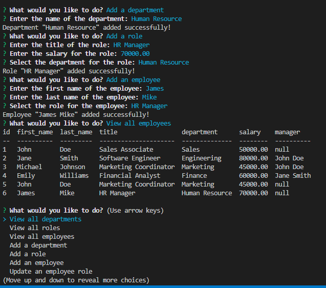

# C12-Employee-Tracker
## Link to application 
https://github.com/Seanye333/C12-Employee-Tracker/tree/main

## Video Tutorial 


## Description
This repository contains the code to build a command-line application from scratch to manage a company's employee database, using Node.js, Inquirer, and MySQL.

!

## Installation
To install this project within your computer, please follow the instruction below
1. Open git bash
2. Create your own file
3. To clone the repository: type in git clone https://github.com/Seanye333/C12-Employee-Tracker/tree/main
4. Use cd to navigate to db path /db 
5. Input mysql -u root -p to command line 
6. Input Source schema.sql 
7. Input source seeds.sql
8. ctrl and z to exit sql 
9. cd to Main path 
10. Input "node server.js" to command line 
11. Answer all questions from prompt to add data to database 


## Usage
Please download the files from my github page and feel free to use it without any cost. 


## Credits
https://dev.mysql.com/doc/
https://www.npmjs.com/package/mysql2
https://www.npmjs.com/package/inquirer/v/8.2.4

## License
This project is licensed under the MIT License.

## Features
Following features are from original acceptance criteria from the project: 
```
GIVEN a command-line application that accepts user input
WHEN I start the application
THEN I am presented with the following options: view all departments, view all roles, view all employees, add a department, add a role, add an employee, and update an employee role
WHEN I choose to view all departments
THEN I am presented with a formatted table showing department names and department ids
WHEN I choose to view all roles
THEN I am presented with the job title, role id, the department that role belongs to, and the salary for that role
WHEN I choose to view all employees
THEN I am presented with a formatted table showing employee data, including employee ids, first names, last names, job titles, departments, salaries, and managers that the employees report to
WHEN I choose to add a department
THEN I am prompted to enter the name of the department and that department is added to the database
WHEN I choose to add a role
THEN I am prompted to enter the name, salary, and department for the role and that role is added to the database
WHEN I choose to add an employee
THEN I am prompted to enter the employee’s first name, last name, role, and manager, and that employee is added to the database
WHEN I choose to update an employee role
THEN I am prompted to select an employee to update and their new role and this information is updated in the database 
```

## How to Contribute
Contributions to this project are not avaiable currently.
